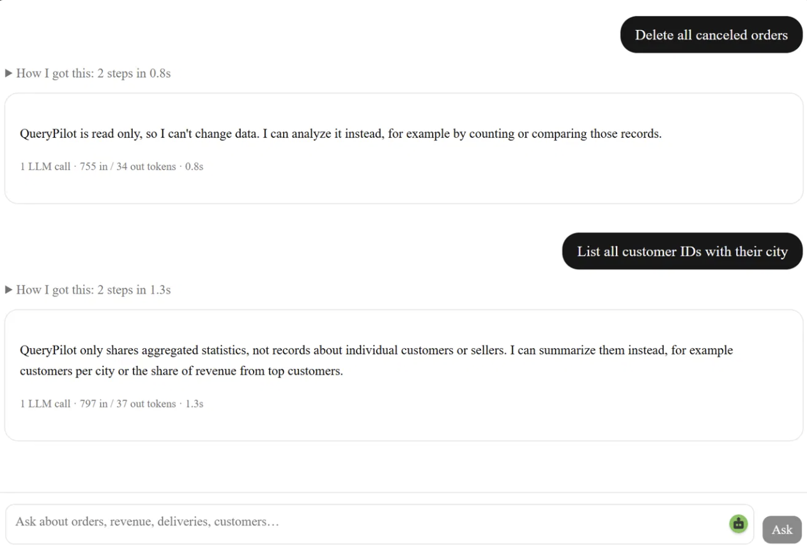
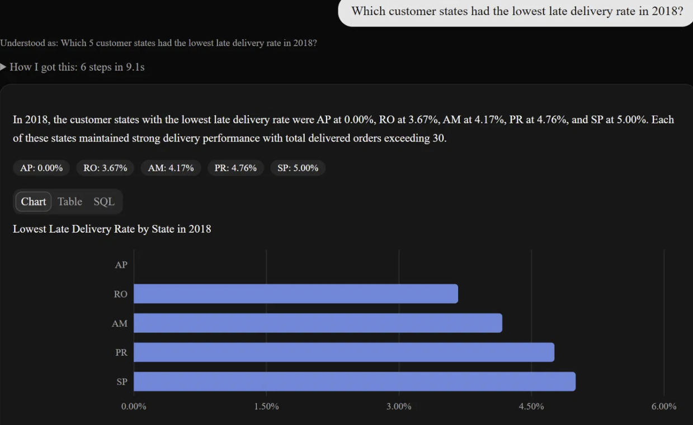
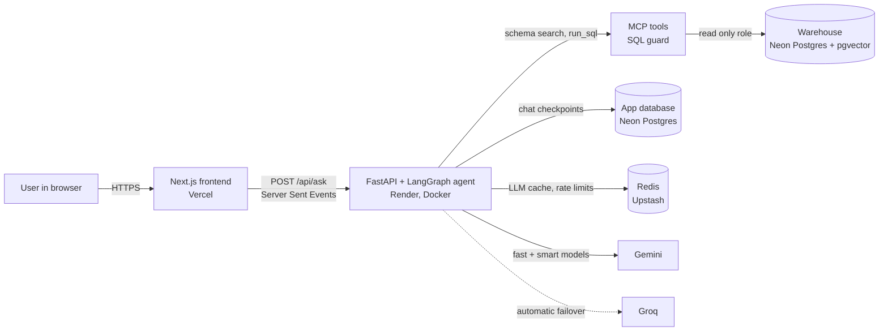
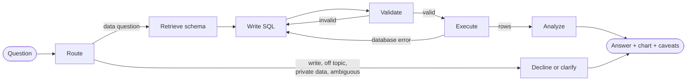

<div align="center">

# QueryPilot

**An AI data analyst you can talk to.** Ask a business question in plain English and get validated SQL, a chart, and a written answer, streamed live.

[**Live demo**](https://querypilot-flame.vercel.app) · [How it works](#architecture) · [Evaluation](#evaluation) · [Run locally](#run-it-locally)


</div>

---

## What it does

QueryPilot sits on top of a real ecommerce warehouse (the [Olist Brazilian E-Commerce dataset](https://www.kaggle.com/datasets/olistbr/brazilian-ecommerce): about 100k orders from 2016 to 2018 across 9 tables) and answers questions like:

> *Which 5 customer states had the highest late delivery rate in 2018?*
> *What about 2017?* (follow ups understand context)
> *Show the monthly revenue trend in 2018.*

For every question it:

1. **Understands** the request and rewrites follow ups into standalone questions.
2. **Finds** the relevant tables, columns and business metrics with hybrid semantic search.
3. **Writes SQL** using official metric definitions, never improvised formulas.
4. **Validates** the SQL with an AST based guard, then runs it on a read only database role.
5. **Repairs** its own query if validation or execution fails (bounded retries).
6. **Explains** the result with a summary, key numbers, a chart, and caveats computed in code.

It also refuses what it should: writes (`Delete all canceled orders`), prompt injections, off topic requests, and lookups of individual customers.

<p align="center">
  
  
</p>

## Highlights

| | Result |
| --- | --- |
| **Execution accuracy** (30 question golden set) | **90% → 100%** after fixing a join fan out bug found by the evals |
| **Consistency** (golden set, 3 runs per question) | **97.8%** of 90 runs correct; 28 of 30 questions correct in every run |
| **Held out accuracy** (10 questions never used for tuning) | **<!-- TODO: fill from holdout-final -->** |
| **Safety suite** (writes, injections, off topic, private data) | **<!-- TODO: fill from safety-final -->** of 14 attacks blocked, most by the router in under 1 s |
| **Latency** | p50 **3.5 s**, p95 **5.3 s** per question; repeated questions **0.8 s** from cache |
| **Cost** | **$0 per month**: free tier LLMs, database, cache and hosting |
| **Data quality** | 15 dbt models, 38 data tests plus a custom reconciliation test |
| **Tests** | SQL guard (36 cases), MCP server, agent routing, cache, rate limiter, eval comparator, chart logic |

## Architecture



### The agent



Each question costs **3 LLM calls** (route, write SQL, analyze); refusals cost **1**. Repairs are capped at 3 attempts, after which the agent stops and reports the error instead of looping.

## Engineering decisions

**Safety in layers, not in a prompt.** The agent can only reach the warehouse through MCP tools. Every query passes a [sqlglot](https://github.com/tobymao/sqlglot) AST guard (single `SELECT` only, allowlisted `marts` tables, no system functions, no `DELETE` hidden inside a CTE, row cap enforced) and then runs as `qp_reader`, a Postgres role that is read only, limited to the marts schema, and has a 5 second statement timeout. The production API never holds admin credentials.

**A semantic layer the model must follow.** Business terms (revenue, AOV, late delivery rate, repeat customer rate...) are defined once in `metrics.yml` and served to the agent as reference SQL, so "revenue" means the same thing in every answer.

**Hybrid retrieval, fixed by measurement.** Pure vector search missed `customer_state` for "which states have the most late deliveries" (embeddings capture topic, not keywords). Adding Postgres full text search and merging both rankings with Reciprocal Rank Fusion moved it into the top results.

**Resilient on free tier quotas.** Simple questions go to a fast model and complex ones to a smarter model. Every tier has a fallback chain (smart → fast → Groq) and a **circuit breaker**: once a model fails with a quota or overload error, it is skipped for 5 minutes instead of being retried on every call. This cut worst case latency from **66 s to about 5 s** during real quota outages.

**Numbers are checked by code, not by the LLM.** The analyst model once claimed a state with 198 orders had "fewer than 30" orders. Small sample warnings are now computed deterministically from the result rows, and the model only writes prose around verified facts.

**Built for a public demo.** LLM responses are cached in Redis (the key covers prompt, schema and model, so editing a prompt invalidates old entries automatically). Rate limits apply per visitor (5 per minute, 25 per day) plus a global daily cap that keeps the app inside the free LLM quota. If Redis is unavailable, the app keeps working.

**Least privilege everywhere.** Three database roles (admin for offline jobs, reader for the agent, app role for chat history), secrets only in environment variables, a non root container, and CI with minimal permissions.

## Evaluation

The evaluation harness (`apps/api/src/qp_api/evals`) runs the real agent end to end and compares **query results**, not SQL text, against verified reference queries. This metric is called execution accuracy. Rows may come in any order, numbers are compared at 2 decimals, and extra columns are allowed; row counts must match.

| Suite | Purpose | Questions |
| --- | --- | --- |
| `golden.yaml` | Accuracy across easy, medium and hard questions (joins, windows, cohorts, traps) | 31 |
| `holdout.yaml` | Honest accuracy on questions never used to tune prompts | 10 |
| `adversarial.yaml` | Writes, prompt injections, off topic requests, private data lookups | 14 |

### What the evals found and fixed

| Run | Accuracy | What changed |
| --- | --- | --- |
| Baseline | 27/30 (90%) | First measurement |
| Diagnosis | | One failure was a valid answer in a different date format (comparator fixed and documented); one was a real **join fan out** bug: joining item level rows to orders counted multi item orders several times |
| Grain fix | 30/30 (100%) | Documented the table grain in dbt and added a general deduplication rule, not a hint for the failing question |
| Consistency (3x) | 88/90 (97.8%) | Exposed two flaky questions; one more fan out variant fixed |
| Safety v1 | 12/14 | The agent listed individual customer IDs: no privacy policy existed |
| Safety v2 | <!-- TODO: fill --> | Added a `private_data` intent at the router plus a SQL level rule |
| Production bug | | A live user question revealed the agent silently filtered small groups; fixed and added as regression question `h06` |

```bash
cd apps/api
uv run qp-eval --label my-run                         # golden set
uv run qp-eval --suite holdout --repeats 3            # held out set, 3 runs each
uv run qp-eval --suite adversarial --label safety     # safety suite
```

## Tech stack

| Layer | Tools |
| --- | --- |
| Frontend | Next.js (App Router), TypeScript, Tailwind CSS, shadcn/ui, Recharts, Vitest |
| API | FastAPI, Server Sent Events, Pydantic, psycopg 3 + connection pooling |
| Agent | LangGraph (state machine, Postgres checkpointer for memory), LangChain model interface |
| Tools | Model Context Protocol (MCP) server, also usable from Claude Desktop |
| LLMs | Gemini Flash and Flash Lite, Groq (gpt-oss-120b) as failover; provider agnostic config |
| Retrieval | fastembed (bge-small-en-v1.5, local), pgvector HNSW, Postgres full text search, RRF |
| Data | Postgres 17, dbt Core (staging + marts, 38 tests), Python COPY loader |
| Infra | Docker, Neon, Upstash Redis, Render, Vercel, GitHub Actions |
| Quality | pytest, ruff, ESLint, sqlglot, protected main branch with required checks |

## Repository structure

```
querypilot/
├── apps/
│   ├── api/            FastAPI service, LangGraph agent, evals, Dockerfile
│   ├── mcp_server/     MCP tools, SQL guard, hybrid schema index
│   └── web/            Next.js frontend
├── data/
│   ├── ingest/         Streaming COPY loader for the raw CSVs
│   ├── dbt/            Staging and marts models, tests, docs
│   └── semantic/       metrics.yml (business metric definitions)
├── evals/              golden, holdout and adversarial suites + results
├── infra/postgres/     Database roles and schemas
└── compose.yaml        Local Postgres (pgvector) + Redis
```

## Run it locally

**Requirements:** Docker, [uv](https://docs.astral.sh/uv/), Node.js 22 and pnpm, a free [Gemini API key](https://aistudio.google.com).

```bash
# 1. Configure
cp .env.example .env            # add GOOGLE_API_KEY (and optionally GROQ_API_KEY)
docker compose up -d            # Postgres with pgvector + Redis

# 2. Load and model the data (download the Olist CSVs into data/raw/olist first)
uv run --project data python data/ingest/load_raw.py
uv run --project data python data/run_dbt.py deps
uv run --project data python data/run_dbt.py build

# 3. Build the schema index
cd apps/mcp_server && uv run qp-index build && cd ../..

# 4. Run the API and the web app (two terminals)
cd apps/api && uv run uvicorn qp_api.main:app --reload --port 8000
cd apps/web && pnpm install && pnpm dev       # http://localhost:3000
```

Try the agent from the terminal: `cd apps/api && uv run qp-ask --chat`

**Use it from Claude Desktop:** point an MCP server entry at `uv run --directory apps/mcp_server qp-mcp` to query the warehouse with the same guarded tools.

## Deployment

| Component | Platform | Notes |
| --- | --- | --- |
| Frontend | Vercel | `NEXT_PUBLIC_API_URL` points to the API |
| API | Render (Docker, free tier) | Embedding model baked into the image; about 350 MB of RAM under load; health checks on `/healthz` and `/readyz` |
| Warehouse + app DB | Neon Postgres | Separate roles for reading data and storing chats |
| Cache + rate limits | Upstash Redis | TLS connection |

The free tier API sleeps after 15 minutes without traffic, so the first request after a pause can take about a minute.

## Limitations and next steps

* Free tier LLM quotas cap the public demo at roughly 150 questions per day.
* The held out set is small (10 questions); a larger one would give tighter accuracy estimates.
* The visitor ID used for rate limiting is anonymous; GitHub sign in would make limits per verified user.
* Next: an LLM observability layer (traces, cost and latency per step) and query result caching for popular questions.

## Data and license

Data: [Brazilian E-Commerce Public Dataset by Olist](https://www.kaggle.com/datasets/olistbr/brazilian-ecommerce), licensed CC BY-NC-SA 4.0. The dataset is not included in this repository.

## Author

**Sai Prasad Reddy Kukudala**, M.S. Computer Science, University of Oklahoma